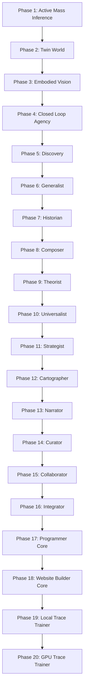

# Causal Constructivism


A causal-graph-first research prototype for active inference, counterfactual simulation, grounded concept discovery, symbolic law search, and metacognitive research workflows.

## Overview

Causal Constructivism is a buildable experimental system that starts from a small physical world and grows a structured causal model around it. The project tests whether an agent can:

- choose actions that reduce uncertainty,
- infer hidden physical properties from observations,
- build and revise causal graphs,
- ask counterfactual questions,
- discover bounded physical concepts such as friction and restitution,
- fit simple symbolic laws,
- generalize patterns across domains,
- and expose later metacognitive behavior through auditable facade modules.

The implementation is intentionally conservative. Phases 1-11 are executable research-core modules backed by simulations, Bayesian updates, graph operations, and tests. Phases 12-16 are research facades: structured, rule-based prototypes that verify data flow and interfaces without claiming open-ended language understanding or autonomous science.

## Implementation Status

| Area | Phases | Status | Implementation depth |
| --- | --- | --- | --- |
| Executable Research Core | 1-11 | Implemented | Simulation-backed, tested, runnable from scripts |
| Research Facades | 12-16 | Implemented as facades | Rule-based, template-based, interface-validating prototypes |
| Programmer Core | 17 | Implemented foundation | Local code indexing, task planning, verification, failure extraction, GPU probe, and JSONL memory |
| Website Builder Core | 18 | Implemented foundation | One-prompt static website generation, manifest output, and trace recording |
| Local Trace Trainer | 19 | Implemented foundation | Trace dataset extraction, local statistical training, model artifact output, and evaluation predictions |
| GPU Trace Trainer | 20 | Implemented runner | CUDA PyTorch training loop, checkpointing, logs, and long-running local training support |
| Future Work | Beyond 20 | Planned | Not implemented in this repository |

## System Architecture



### Executable Research Core: Phases 1-11

| Phase | Name | What it does |
| --- | --- | --- |
| 1 | Active Mass Inference | Chooses force actions, observes acceleration, and updates a posterior over hidden mass. |
| 2 | Twin World | Builds actual and counterfactual worlds with shared exogenous samples and graph surgery. |
| 3 | Embodied Vision | Projects synthetic RGB-D observations, tracks objects through occlusion, and persists temporal graphs. |
| 4 | Closed Loop Agency | Links perception, planning, action execution, and mass belief updates in an embodied loop. |
| 5 | Discovery | Detects prediction residuals and integrates a bounded discovered friction concept. |
| 6 | Generalist | Transfers a learned concept across environments and revises it when contradicted by evidence. |
| 7 | Historian | Replays experiment histories under policy interventions for methodology-level counterfactuals. |
| 8 | Composer | Compares single-concept and pairwise physical models to discover compound explanations. |
| 9 | Theorist | Searches bounded symbolic expression templates and discovers a pendulum square-root law. |
| 10 | Universalist | Abstracts structurally similar laws into a cross-domain harmonic-motion principle. |
| 11 | Strategist | Evaluates discovery policies and adopts better methodology only when grounding is preserved. |

### Research Facades: Phases 12-16

| Phase | Name | What it does |
| --- | --- | --- |
| 12 | Cartographer | Builds a small conceptual atlas over discovered concepts and meta-relations. |
| 13 | Narrator | Generates template-based grounded explanations from the conceptual graph. |
| 14 | Curator | Identifies sparse ontology regions and proposes research questions. |
| 15 | Collaborator | Simulates structured debate between internal scientist agents and records consensus. |
| 16 | Integrator | Runs an end-to-end orchestration cycle across the agent lifecycle. |

### Local Action Core: Phase 17

| Phase | Name | What it does |
| --- | --- | --- |
| 17 | Programmer Core | Indexes Python code with AST, maps symbols/imports/tests, plans likely target files for a task, runs verification commands, extracts failures, probes local NVIDIA acceleration, and can record JSONL memory traces. |
| 18 | Website Builder Core | Builds a complete static website from one prompt, writes HTML/CSS/JS/manifest files, and records a generation trace for future learning. |
| 19 | Local Trace Trainer | Reads verified local traces, builds a supervised prompt-to-artifact dataset, trains a lightweight local model, saves a model artifact, and reports predictions. |
| 20 | GPU Trace Trainer | Runs a CUDA PyTorch transformer over local trace data, saves checkpoints, and supports long-running training jobs on the local RTX GPU. |

## Features

- Typed causal graph with validated node and edge contracts.
- Gaussian beliefs, belief propagation, and approximate free-energy reporting.
- Expected-free-energy action selection for active mass inference.
- Multi-object 1D collision physics and counterfactual graph surgery.
- Synthetic RGB-D perception, object permanence, and temporal graph persistence.
- Optional MuJoCo adapter for native 3D stepping and rendering.
- Closed-loop embodied active-inference benchmark.
- Bounded neural structure proposal for friction discovery.
- Serializable concept library with transfer, contradiction, and revision.
- History replay for policy-level counterfactual evaluation.
- Multi-concept physical grammar for friction and restitution.
- Bounded symbolic law search for square-root physical laws.
- Cross-domain law unification over harmonic-motion systems.
- Strategy evaluation with adoption gates based on efficiency and grounding.
- Phase 12-16 facade benchmarks for conceptual mapping, explanation, agenda formation, collaboration, and orchestration.
- Phase 17 local programming-core benchmark for code inspection, task planning, verification, failure analysis, GPU probing, and evidence memory.
- Phase 18 one-prompt website generation with self-contained static output.
- Phase 19 local training pipeline over Programmer and Website Builder traces.
- Phase 20 GPU-backed trace-model trainer using CUDA PyTorch.
- PowerShell runner scripts for every implemented phase.
- Standard-library-focused test suite with optional MuJoCo coverage.
- JSON demo baselines for Phases 1-16 in [`docs/demo-baseline`](docs/demo-baseline/README.md).

## Installation

### Requirements

- Python 3.11 or newer
- PowerShell 7 or Windows PowerShell
- Optional: MuJoCo support for native 3D rendering and simulation

### Clone and install

```powershell
git clone https://github.com/abdallah2183/causal-constructivism.git
cd causal-constructivism
python -m pip install -e ".[dev]"
```

Optional MuJoCo dependencies:

```powershell
python -m pip install -e ".[dev,embodied]"
```

## Run

Run the first active-inference demo:

```powershell
.\scripts\run.ps1 -Steps 5 -Json
```

Run the full set of phase benchmarks:

```powershell
.\scripts\run-twin.ps1 -InterventionVariable action.force -InterventionValue 2 -QueryVariable green.position -Json
.\scripts\run-embodied.ps1 -Database artifacts\embodied-vision.db -Json
.\scripts\run-closedloop.ps1 -Experiments 6 -Json
.\scripts\run-discovery.ps1 -Friction 0.25 -Json
.\scripts\run-generalist.ps1 -SourceFriction 0.30 -TargetFriction 0.05 -ConceptLibrary artifacts\generalist.json -Json
.\scripts\run-historian.ps1 -HistoryLength 6 -TrueMass 2.5 -HiddenFriction 0.25 -Json
.\scripts\run-composer.ps1 -Friction 0.25 -Restitution 0.65 -CompoundCount 8 -Json
.\scripts\run-theorist.ps1 -LawObservations 20 -Gravity 9.81 -Json
.\scripts\run-universalist.ps1 -Json
.\scripts\run-strategist.ps1 -HistoryLength 6 -TrueMass 2.5 -HiddenFriction 0.25 -Json
.\scripts\run-cartographer.ps1 -Json
.\scripts\run-narrator.ps1 -Json
.\scripts\run-curator.ps1 -Json
.\scripts\run-collaborator.ps1 -Json
.\scripts\run-integrator.ps1 -Json
.\scripts\run-programmer.ps1 -Task "improve graph error handling" -Json
.\scripts\run-website-builder.ps1 -Prompt "Build a complete landing page for a local cognitive engine that programs, verifies, remembers, and runs on my RTX GPU." -Json
.\scripts\run-training.ps1 -Json
.\scripts\run-gpu-training.ps1 -DurationSeconds 3600
```

Run the installed console command:

```powershell
causal-constructivism --steps 5 --json
```

## Demo 🎬

### Phase 1: active mass inference

Command:

```powershell
.\scripts\run.ps1 -Steps 5 -Json
```

Example output excerpt:

```json
[
  {
    "step": 1,
    "force": 6.0,
    "acceleration": 2.3872059855776198,
    "mass_mean": 2.516716553048011,
    "mass_std": 0.052852080416692614,
    "free_energy": 1.9582547089010283,
    "grounding": "confident",
    "grounding_confidence": 0.9391664360547156
  }
]
```

What happens: the system chooses a force, observes acceleration, updates its mass posterior, and records grounding evidence for the inferred property.

### Phase 12: Cartographer facade

Command:

```powershell
.\scripts\run-cartographer.ps1 -Json
```

Example output excerpt:

```json
{
  "query_node": "concept.friction",
  "node_count": 3,
  "edge_count": 2,
  "grounding_quality": 1.0,
  "grounding": "confident",
  "analogies": ["concept.damping"]
}
```

What happens: the facade builds a small conceptual atlas linking friction, restitution, and damping, then queries neighborhoods, analogies, and candidate distinguishing experiments.

### Phase 16: Integrator facade

Command:

```powershell
.\scripts\run-integrator.ps1 -Json
```

Example output excerpt:

```json
{
  "steps_count": 6,
  "grounding_quality": 1.0,
  "status": "confident"
}
```

What happens: the orchestrator coordinates the major lifecycle stages into one audited run: agency, discovery/composition, abstraction, strategy, curation, and collaboration.

### Phase 17: Programmer Core

Command:

```powershell
.\scripts\run-programmer.ps1 -Task "add safer graph validation" -Json
```

Example output excerpt:

```json
{
  "phase": 17,
  "status": "verified",
  "project": {
    "modules": 65,
    "symbols": 686,
    "syntax_errors": 0
  },
  "accelerator": {
    "available": true,
    "name": "NVIDIA GeForce RTX 5060 Ti"
  }
}
```

What happens: the Programmer Core inspects the repository, indexes source and test symbols, identifies likely target files for the requested programming task, runs local verification, reports failures if any, and records evidence if memory is enabled.

### Phase 18: Website Builder Core

Command:

```powershell
.\scripts\run-website-builder.ps1 `
    -Prompt "Build a complete landing page for a local cognitive engine that programs, verifies, remembers, and runs on my RTX GPU." `
    -Json
```

Example output excerpt:

```json
{
  "phase": 18,
  "status": "built",
  "title": "Local Cognitive Engine",
  "files": ["README.md", "app.js", "index.html", "manifest.json", "styles.css"]
}
```

What happens: the Website Builder Core converts a single prompt into a complete local static website. It does not require a server, and it records a manifest so the generated artifact can be inspected.

### Phase 19: Local Trace Trainer

Command:

```powershell
.\scripts\run-training.ps1 -Json
```

Example output excerpt:

```json
{
  "phase": 19,
  "status": "trained",
  "model_path": "models/local-trace-model.json",
  "accelerator_used": false
}
```

What happens: the trainer reads local JSON/JSONL traces, normalizes them into a supervised dataset, trains an inspectable local trace model, saves the model artifact, and returns predictions for an evaluation prompt. It reports GPU availability, but this first trainer does not use GPU tensor acceleration.

### Phase 20: GPU Trace Trainer

Command:

```powershell
.\scripts\run-gpu-training.ps1 -DurationSeconds 3600
```

What happens: the trainer uses CUDA PyTorch to train a transformer-based multi-label trace model on local prompt/artifact traces and deterministic augmentations. It writes logs and checkpoints to `models/gpu-trace-model/` by default. For long-running experiments, use an ignored output path under `artifacts/`.

Full expected outputs are stored in [`docs/demo-baseline`](docs/demo-baseline/README.md).

## Test ✅

```powershell
.\scripts\test.ps1
```

The current suite covers graph contracts, inference, planning, persistence, counterfactuals, discovery, transfer, symbolic laws, strategy evaluation, and Phase 12-16 facade behavior.

## Project Structure

```text
.
├── assets/
│   └── scenes/                 # MuJoCo XML scenes
├── docs/
│   ├── ARCHITECTURE.md         # Detailed architecture notes
│   ├── GITHUB_PUBLISHING.md    # GitHub publication guide
│   ├── LOCAL_GPU_LEARNING.md   # Honest local GPU learning path
│   ├── generated-websites/     # Phase 18 static website output
│   ├── training-data/          # Phase 19 normalized training data
│   └── demo-baseline/          # JSON outputs for Phases 1-19
├── models/                     # Local trained model artifacts
├── scripts/                    # PowerShell runners and test command
├── src/
│   └── causal_constructivism/  # Package source
├── tests/                      # Unit and integration tests
├── pyproject.toml              # Package metadata
└── README.md
```

## Scope and Limitations

This repository is a research prototype, not a production robotics stack or a general artificial scientist.

Current limitations:

- RGB-D perception is synthetic and controlled.
- MuJoCo support is optional and limited to starter scenes and benchmark rollouts.
- Discovery grammars are bounded and domain-specific.
- Symbolic law search uses constrained templates rather than open-ended theorem discovery.
- Phases 12-16 are facades that validate architecture, data flow, and audit contracts.
- The Narrator uses deterministic templates, not an LLM.
- The Collaborator simulates debate structure; it does not implement independent scientific agents with open-ended reasoning.
- The Programmer Core does not yet synthesize arbitrary patches by itself; it is the local inspection, planning, verification, failure-analysis, and memory foundation for that next step.
- The Website Builder Core is deterministic local generation. It is not evidence that neural training has occurred.
- Phase 19 trains a small local statistical model from traces. It is real training, but not neural GPU training.
- Phase 20 is real CUDA neural training over local trace data. It is still small-scale and dataset-limited, not frontier-model training.
- Larger GPU neural training still requires a larger dataset and a stronger evaluation harness.
- Grounding audits trace provenance through the system; they do not prove real-world truth.

## Future Roadmap

- Add a cross-platform baseline regeneration script.
- Replace placeholder badge owner after GitHub publication.
- Add generated architecture diagrams under `docs/images/`.
- Expand real MuJoCo scene coverage and CI matrix behavior.
- Add richer benchmark summaries for comparing phase outputs over time.
- Introduce stricter JSON schema validation for demo outputs.
- Separate research-facade contracts from future open-ended implementations.
- Add a small web or notebook demo for easier inspection.
- Extend Phase 17 from planning and verification into bounded patch generation and repair.
- Add a local GPU model adapter for quantized code models.
- Add supervised trace learning from successful programming tasks.
- Add a sandboxed self-repair benchmark over intentionally broken mini-projects.
- Add local model-backed website generation after a prompt/site/evaluation dataset exists.
- Add LoRA/QLoRA fine-tuning after a compatible local foundation model is configured.

## GitHub Publication 🚀

See [`docs/GITHUB_PUBLISHING.md`](docs/GITHUB_PUBLISHING.md) for the full publishing checklist, recommended repository name, GitHub description, topics, badges, visual ideas, and AI image prompts.

## Author

Abdullah Salem Saleh Al-Faqeer

Email: abdallahor1991254@gmail.com

## License

MIT License. See [`LICENSE`](LICENSE).
