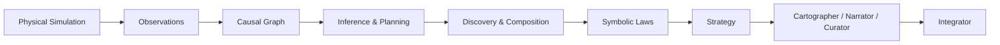

# GitHub Publishing Guide

This guide prepares the local Causal Constructivism project for publication under:

- Name: Abdullah Salem Saleh Al-Faqeer
- Email: abdallahor1991254@gmail.com
- GitHub account: `abdallah2183`

## 1. Create the GitHub Repository

Use the GitHub CLI from the repository root:

```powershell
gh repo create abdallah2183/causal-constructivism `
    --public `
    --description "Causal-graph active-inference research prototype with discovery, counterfactuals, symbolic laws, and metacognitive facades." `
    --source . `
    --remote origin
```

Equivalent GitHub UI settings:

| Field | Value |
| --- | --- |
| Repository name | `causal-constructivism` |
| Description | `Causal-graph active-inference research prototype with discovery, counterfactuals, symbolic laws, and metacognitive facades.` |
| Visibility | Public |
| Initialize with README | No, because the local repo already has one |
| Add .gitignore | No, because the local repo already has one |
| Choose a license | No, because the local repo already includes MIT |

Repository URL:

```text
https://github.com/abdallah2183/causal-constructivism
```

## 2. Connect the Local Repo to GitHub

From the project root:

```powershell
cd C:\Users\abdal\OneDrive\Desktop\NWO
```

Confirm the current local commit:

```powershell
git log --oneline -1
```

Confirm the local author identity:

```powershell
git config user.name
git config user.email
```

Expected values:

```text
Abdullah Salem Saleh Al-Faqeer
abdallahor1991254@gmail.com
```

If the GitHub CLI did not already set the remote:

```powershell
git remote add origin https://github.com/abdallah2183/causal-constructivism.git
```

If a placeholder remote already exists:

```powershell
git remote set-url origin https://github.com/abdallah2183/causal-constructivism.git
```

Verify:

```powershell
git remote -v
```

## 3. Push the Project

Rename the default branch to `main`:

```powershell
git branch -M main
```

Push the project:

```powershell
git push -u origin main
```

After the push succeeds, the project page will be:

```text
https://github.com/abdallah2183/causal-constructivism
```

## 4. Confirm the README Badge

The README uses a static local-test badge because this project was verified
locally before publication:

```markdown

```

If GitHub Actions is available on the account, add a workflow badge later:

```markdown

```

## 5. Suggested GitHub UI Setup

### Repository Name

Recommended:

```text
causal-constructivism
```

Alternative names:

- `causal-constructivism-agent`
- `active-inference-causal-graphs`
- `causal-constructivism-prototype`

### Short Description

```text
Causal-graph active-inference research prototype with discovery, counterfactuals, symbolic laws, and metacognitive facades.
```

### Topics

Use these GitHub topics:

```text
active-inference
causal-graphs
counterfactual-reasoning
bayesian-inference
symbolic-regression
physics-simulation
mujoco
research-prototype
python
ai-agents
scientific-discovery
causal-inference
```

### Website Field

Leave blank unless you publish documentation or a project page later.

## 6. README Badges

Current README badges:

```markdown


```

The local-test badge reflects the most recent verified local run:

```text
66 tests OK, 1 skipped
```

## 7. Folder Structure Suggestions

The current structure is good for publication. Recommended next improvements:

```text
docs/
|-- images/                 # Banner, architecture diagram, screenshots
|-- demo-baseline/          # Existing JSON output baselines
|-- ARCHITECTURE.md         # Existing architecture details
`-- GITHUB_PUBLISHING.md    # This guide
```

Optional future additions:

- `docs/images/banner.png`
- `docs/images/architecture.png`
- `docs/images/phase-map.png`
- `docs/images/demo-phase01.png`
- `docs/images/demo-phase16.png`
- `scripts/regenerate-baseline.ps1`

## 8. Visual Ideas

### Project Banner

Concept:

> A clean dark technical banner showing a causal graph over a physical simulation grid, with small nodes labeled mass, force, friction, restitution, law, policy, and grounding.

Recommended size:

```text
1600 x 500
```

Recommended tools:

- Figma
- Canva
- draw.io / diagrams.net
- Excalidraw
- DALL-E, Midjourney, or Stable Diffusion for concept art

AI image prompt:

```text
Create a professional GitHub repository banner for a research software project called "Causal Constructivism". Show a dark technical background with a clean causal graph, physics simulation blocks, arrows for counterfactual worlds, and small labels such as mass, force, friction, law, policy, and grounding. Style: modern scientific visualization, minimal, precise, no people, no robots, no exaggerated sci-fi, high readability, 1600 by 500.
```

### Architecture Diagram

Concept:

> A left-to-right pipeline from physical simulation to causal graph, inference, discovery, symbolic laws, strategy, conceptual atlas, explanation, curation, collaboration, and integration.

Recommended tools:

- Mermaid
- draw.io / diagrams.net
- Figma

Mermaid starter:



AI image prompt:

```text
Create a clean software architecture diagram for a Python research prototype. It should show phases grouped into two sections: Executable Research Core phases 1-11 and Research Facades phases 12-16. Use boxes, arrows, and muted blue/orange colors. Include labels: Causal Graph, Active Inference, Twin World, Discovery, Theorist, Universalist, Strategist, Cartographer, Narrator, Curator, Collaborator, Integrator. Professional technical diagram, white background, readable text.
```

### Phase Diagram

Concept:

> A numbered 1-16 phase map with a visual split between executable core and facades.

Recommended tools:

- Mermaid
- Figma
- draw.io / diagrams.net

AI image prompt:

```text
Design a phase map for a research prototype named Causal Constructivism. Show 16 numbered phases in order. Phases 1-11 are labeled Executable Research Core and phases 12-16 are labeled Research Facades. Use a clean academic style with subtle colors, simple icons for physics, graph, discovery, law, strategy, map, narration, agenda, collaboration, and integration. No marketing hype.
```

### Example Output Screenshots

Ideas:

- Terminal screenshot of `.\scripts\run.ps1 -Steps 5 -Json`
- Terminal screenshot of `.\scripts\run-cartographer.ps1 -Json`
- Terminal screenshot of `.\scripts\run-integrator.ps1 -Json`
- Screenshot of the GitHub Actions test run after publishing

Recommended tools:

- Windows Terminal
- PowerShell
- Carbon: https://carbon.now.sh
- Ray.so: https://ray.so

## 9. Demo Section Strategy

The README includes three representative demos:

- Phase 1 active mass inference
- Phase 12 Cartographer facade
- Phase 16 Integrator facade

The full outputs live in:

```text
docs/demo-baseline/
```

Keep the README examples short. Avoid pasting all phase outputs into the README because it makes the repository harder to scan.

## 10. Final Publish Checklist

Before pushing:

```powershell
.\scripts\test.ps1
git status --short
```

Expected test result:

```text
66 tests OK, 1 skipped
```

Expected git status after commit:

```text
# no tracked file changes
```

Publish:

```powershell
git branch -M main
git remote add origin https://github.com/abdallah2183/causal-constructivism.git
git push -u origin main
```
